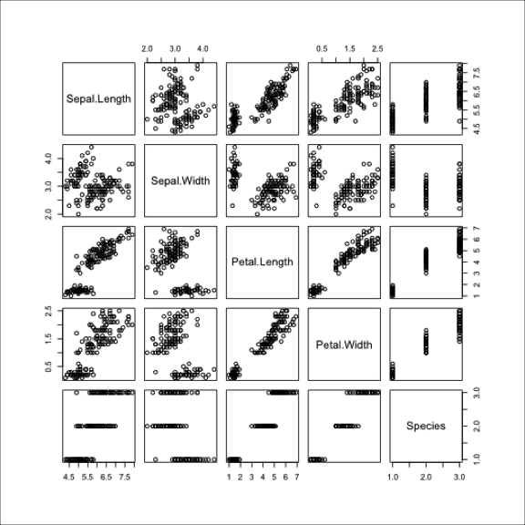

# showimage

> Show an Image on an R Graphics Device

<!-- badges: start -->
[](https://github.com/r-lib/showimage/actions/workflows/R-CMD-check.yaml)
[](http://www.repostatus.org/#active)
[](http://www.r-pkg.org/pkg/showimage)
[](http://www.r-pkg.org/pkg/showimage)
[](https://app.codecov.io/gh/r-lib/showimage?branch=main)
<!-- badges: end -->

Sometimes it is handy to be able to view an image file on an
R graphics device. This package just does that. Currently it supports
PNG files.

## Installation


```r
devtools::install_github("r-lib/showimage")
```

## Usage


```r
library(showimage)
png(tmp <- tempfile(fileext = ".png"))
pairs(iris)
dev.off()
show_image(tmp)
```



## License

GPL-2 | GPL-3 © [Mango Solutions](https://github.com/mangothecat),
Simon Urbanek, [RStudio](https://github.com/rstudio)
